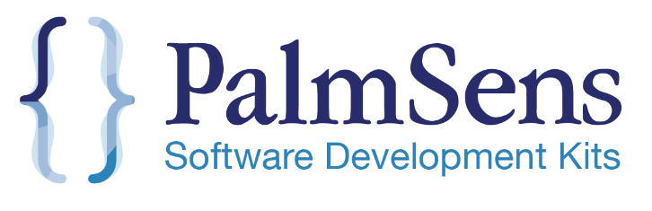

# PalmSens SDK

Take full control of your PalmSens instruments and modules with the PalmSens Software Development Kits (SDKs) and code examples.

SDKs are available for the ecosystems below. See the links for installation instructions, code documentation, and examples.

- [Python](./python) - [documentation](https://palmsens.github.io/PalmSens_SDK/python/latest/intex.html)
- [Matlab](./matlab) - [documentation](https://palmsens.github.io/PalmSens_SDK/matlab/latest/intex.html)
- [Labview](./labview) - [documentation](https://palmsens.github.io/PalmSens_SDK/labview/latest/intex.html)
- [Dotnet](./dotnet) (WIP)

