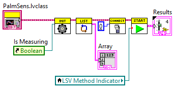
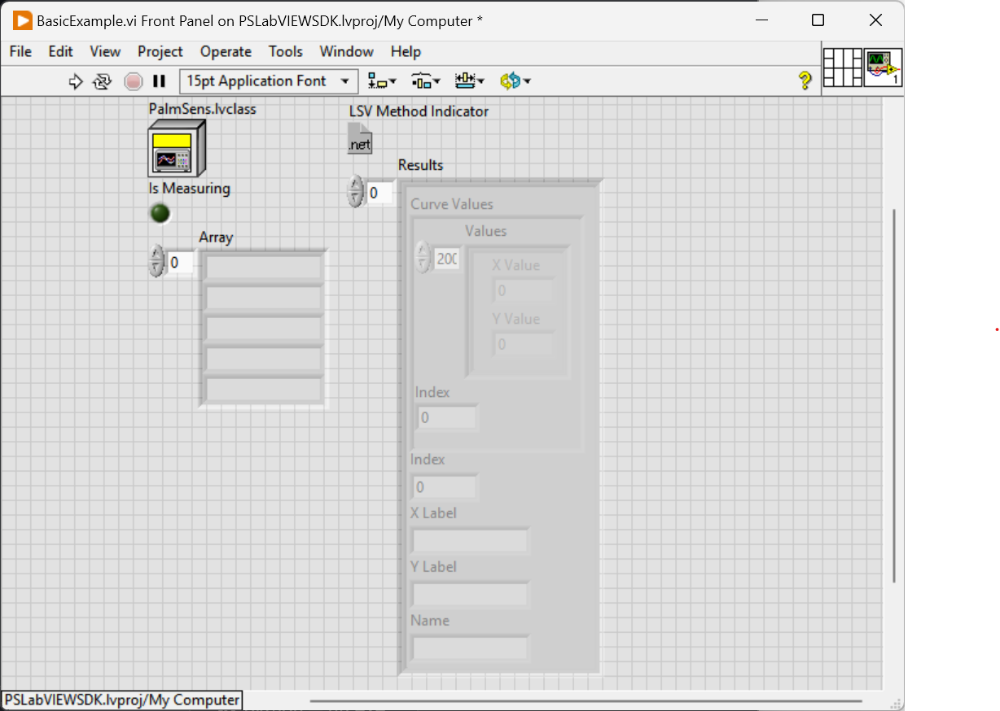
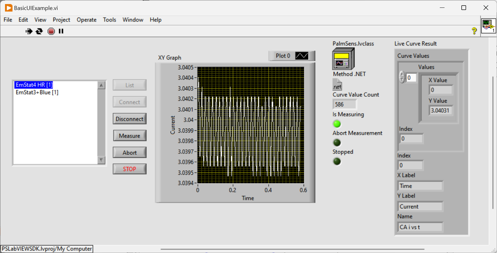
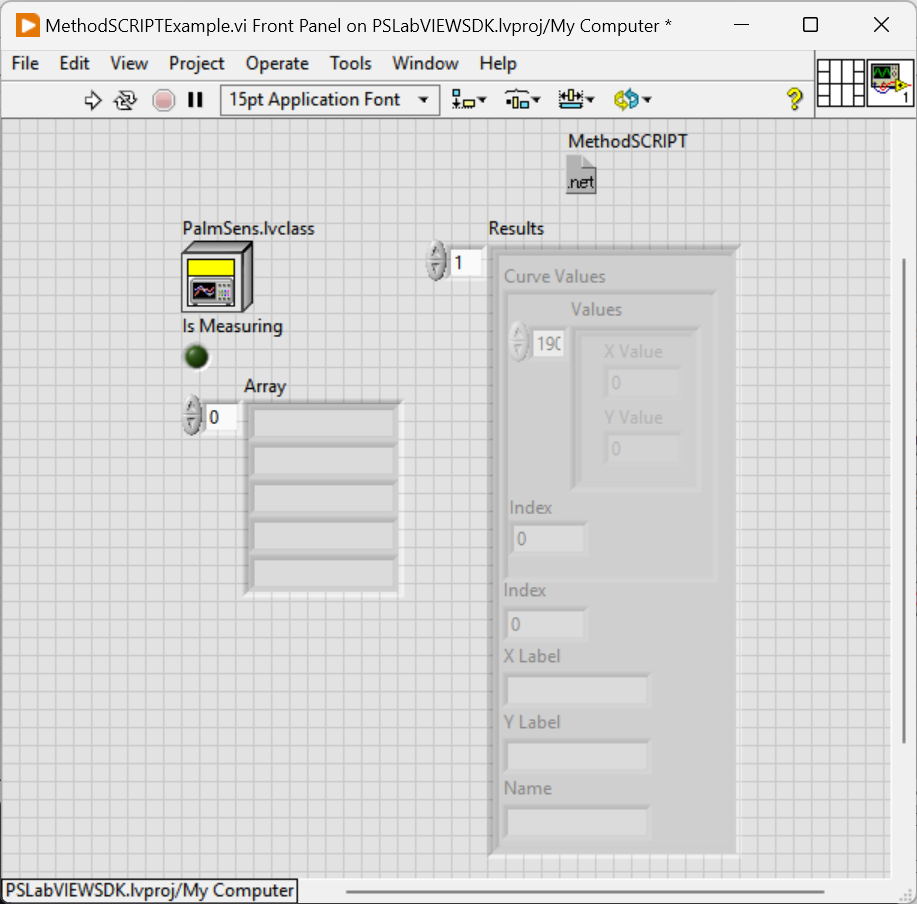

# Labview SDK for PalmSens devices

 

    

 

With this SDK, you can control your PalmSens instrument and process the data in Labview.
Connect, control and process data from your PalmSens instrument using Labview.

Download the latest [release here](https://github.com/palmsens/PalmSens_SDK/releases).

See [the installation guidelines](https://sdk.palmsens.com/labview/latest/installation.html) for more information.

## SDK overview

The PalmSens SDK contains the following .NET libraries and LabVIEW
classes, controls and Vis in the PalmSens folder:

- **Libraries Folder**: Contains all the necessary .NET libraries. Labview directly interfaces with the classes and functions defined in these libraries.

- **PalmSens LabVIEW class**:

    Class that implements the basic features required to use our instruments
    in LabVIEW.

    * `Initialise`: Initialises the class and .NET libraries.
    * `Dispose`: Frees up memory used by .NET libraries.
    * `ListInstruments`: Returns an array of the available instruments.
    * `Connect`: Connects to the specified instrument.
    * `Disconnect`: Disconnects from the connected instrument.
    * `Measure`: Performs a measurement.
    * `AbortMeasurement`: Aborts the current measurement

- **`MeasurementResults` and `LiveCurveResults` controls**: Type definitions for the in and outputs of the `Measure` function.

- **Event Callback VIs**: VIs used by the Measure function to receive data from .NET events.

## Example programs

The following examples are included.

|  |  |  |
| - | - | - |
| **Getting started example**: Demonstrates how to use the PalmSens class to run a measurement. | **UI example**: Demonstrates how to use the PalmSens class to run and plot a measurement in real-time and the recommended method to abort, disconnect, or terminate the app during an active measurement. | **MethodSCRIPT example**: Demonstrates how to use the PalmSens class to run a MethodSCRIPT™ measurement. |

For more information, see the [documentation](https://sdk.palmsens.com/labview/latest/index.html)
