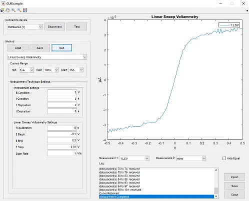
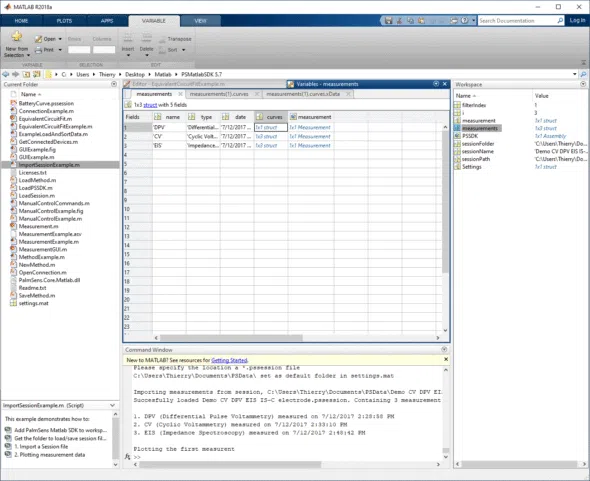
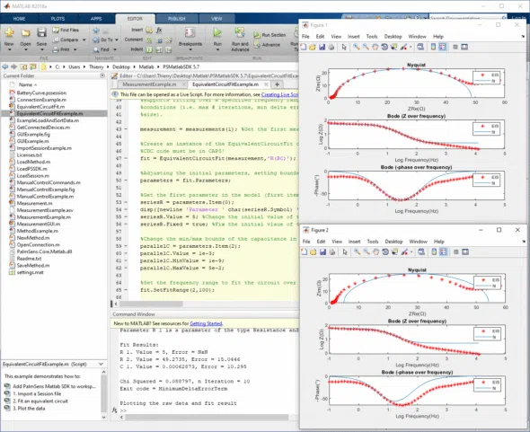

# Matlab SDK for PalmSens devices

With this SDK, you can control your PalmSens instrument and process the data in MATLAB.
Connect, control and process data from your PalmSens instrument using MATLAB.

| |  |  |
| - | - | - |
| **Control your instrument using MATLAB** | **Import experimental results from PSTrace** | **Generate Nyquist and Bode plots** |

## Installation

To use the matlab SDK, download the latest [release here](https://github.com/palmsens/palmsens_sdk/releases).
Unzip and load the directory in Matlab.

## Examples

The SDK contains the following examples and functions aimed to help you with using PalmSens and Emstat devices in Matlab.

- [`ConnectionExample.m`](./ConnectionExample.m): Detailed explanation on how to detect and connect to your device.
- [`EquivalentCircuitFitExample.m`](./EquivalentCircuitFitExample.m): An example of equivalent circuit fitting
- [`GUIExample.m`](./GUIExample.m): An example of a Matlab user interface for performing measurements with your device.
- [`ImportSessionExample.m`](./ImportSessionExample.m): Detailed explanation on how to import and view measurements from a `.pssession` file created with PSTrace 5.x or MultiTrace 4.x.
- [`ManualControlExample.m`](./ManualControlExample.m): An example of a Maltab user interface for manual control of your device.
- [`MeasurementExample.m`](./MeasurementExample.m): Detailed explanation on how to perform a measurement, specified in a method, with a connected PalmSens or Emstat device.
- [`MethodExample.m`](./MethodExample.m): Detailed explanation on how to load, edit and create new methods (methods are used to specify technique and the settings for a measurment).
- [`MultiChannelMeasurementLoopExample.m`](./MultiChannelMeasurementLoopExample.m): An example of connecting to and running measurements on multiple instruments/channels.

## Functions

- [`GetConnectedDevices.m`](./GetConnectedDevices.m): Returns a list of connected PalmSens and Emstat devices.
- [`LoadMethod.m`](./LoadMethod.m): Loads a method from a *.psmethod file.
- [`LoadPSSDK.m`](./LoadPSSDK.m): Loads the PalmSens Matlab SDK.
- [`LoadSession.m`](./LoadSession.m): Load (a) measurement(s) from a `.pssession` file.
- [`MultiChannelMeasurementLoopHelper.m`](./MultiChannelMeasurementLoopHelper.m): Waits for multiple instruments to finish their measurements/
- [`NewMethod.m`](./NewMethod.m): Creates a new method.
- [`OpenConnection.m`](./OpenConnection.m): Opens a connection to a device.
- [`SaveMethod.m`](./SaveMethod.m): Saves a method.

## Classes

- [`EquivalentCircuitFit.m`](./EquivalentCircuitFit.m): Handles the equivalent circuit fitting using the `PalmSens.Core.Matlab.dll`.
- [`Measurement.m`](./Measurement.m): Returns data measured by a device as a variable, message in the command window and/or a plot in a figure.
- [`MeasurementGUI.m`](./MeasurementGUI.m): Version of the Measurement.m class that can be used with a Matlab GUIDE user interface.
- [`MultiChannelMeasurement.m`](./MultiChannelMeasurement.m): Used for running when connected to multiple instruments simultaneaously, please refer to the [`MultiChannelMeasurementLoopExample`](./MultiChannelMeasurementLoopExample.m).
