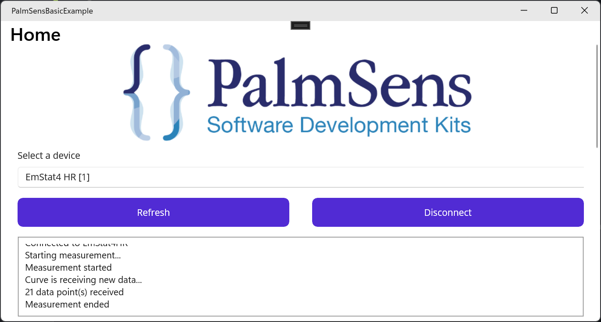

# .NET MAUI SDK for PalmSens devices

    

**The .NET MAUI SDK is under active development and not ready for actual use.**

With this PalmSens Software Development Kit you develop Windows applications in Visual Studio using [.NET MAUI](https://dotnet.microsoft.com/en-us/apps/maui).

.NET MAUI is a multi-platform app UI framework that lets you build native, cross-platform desktop and mobile apps with one codebase.
The PalmSens .NET MAUI SDK can be used with all PalmSens instruments and potentiostat modules.

For more information, see the [documentation](https://sdk.palmsens.com/maui/latest/index.html).

## Making a new app

1. Copy the directory, e.g. `BasicExampleApp`
2. Rename the directory, e.g. `MyPalmSensApp`
3. Rename the `BasicExampleApp.csproj` file to `MyPalmSensApp.csproj`
4. Right click Solution > Add > Existing Project, select `.csproj` file
5. Update namespace (find-replace), `BasicExampleApp` -> `MyPalmSensApp`
