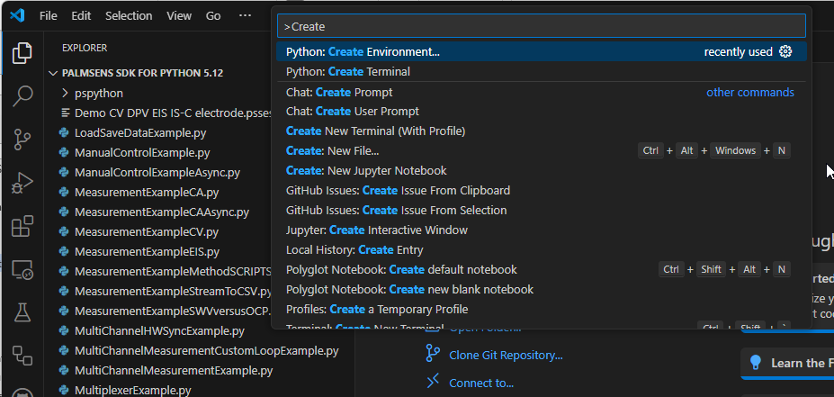
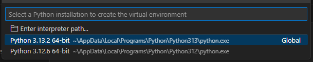
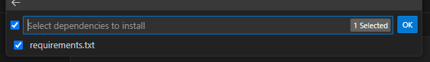
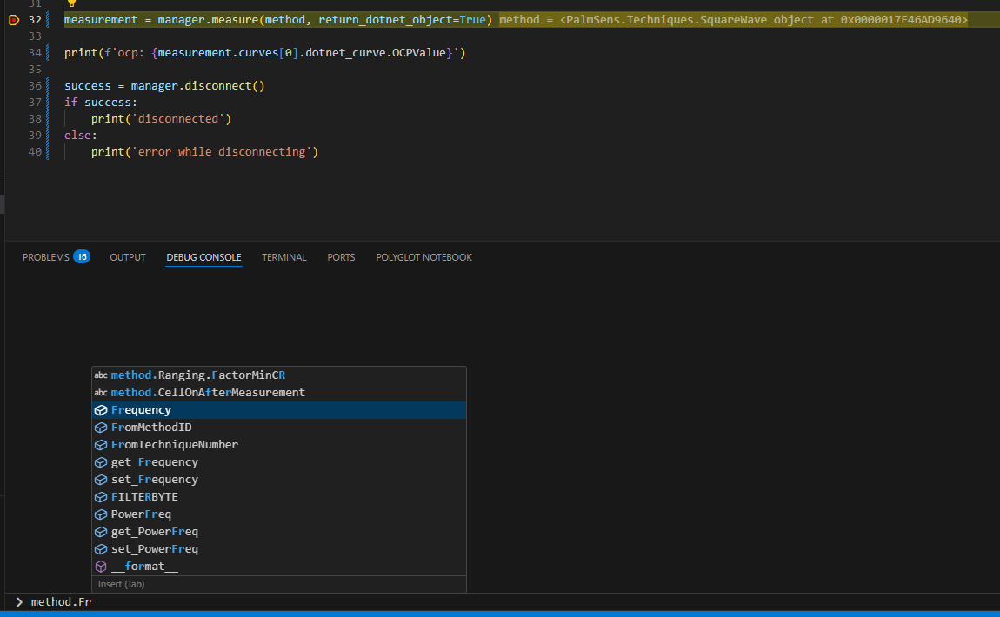
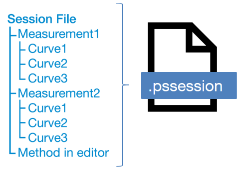
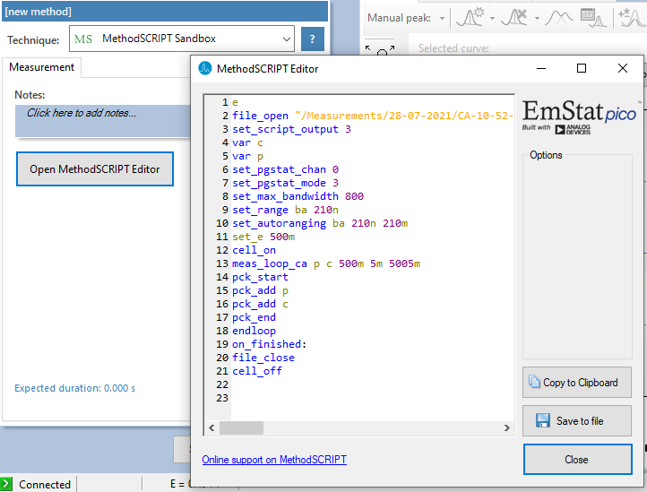
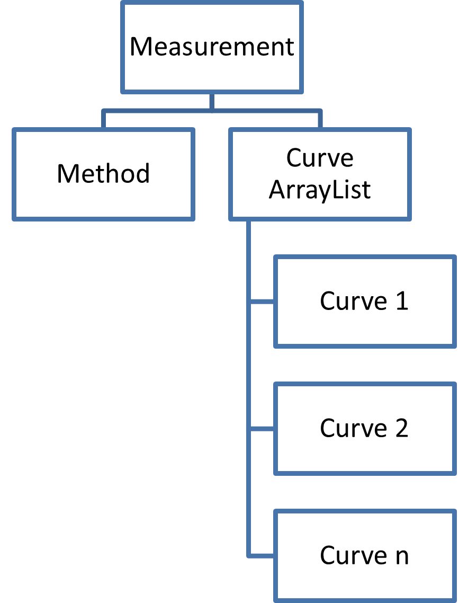
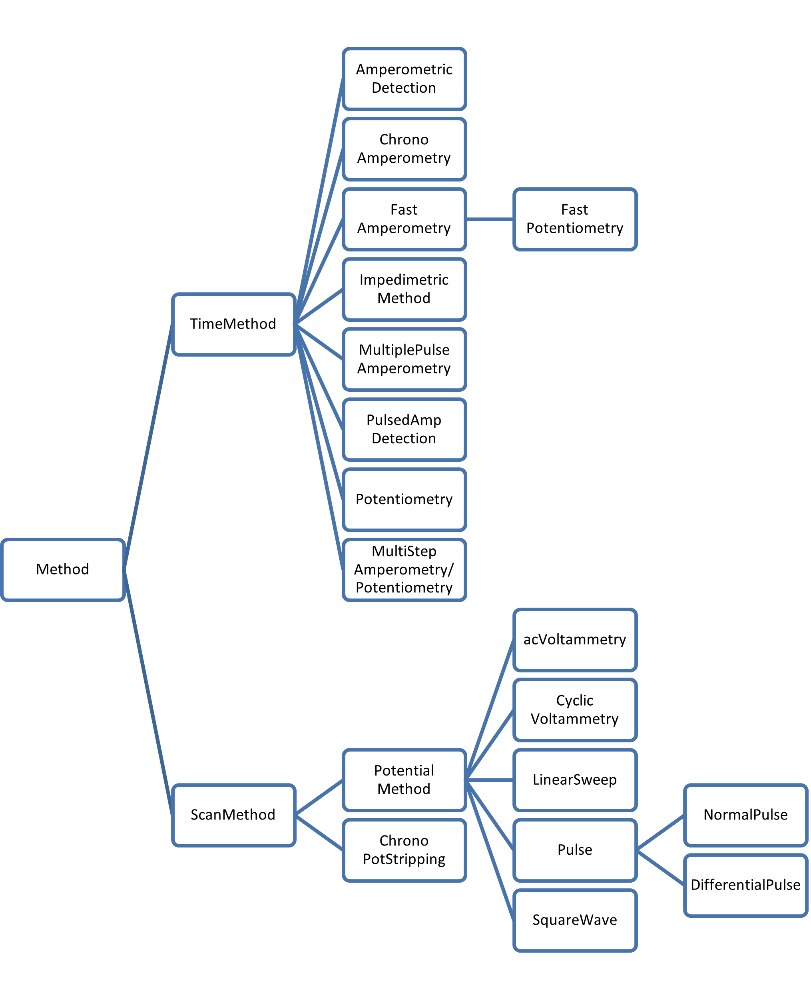
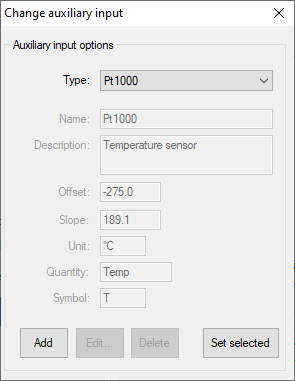

# Getting started with PalmSens SDK for Python

Based on PalmSens SDK v5.12  
Last revision: April 24, 2025

## Contents of the PalmSens SDK

The PalmSens SDK contains the following libraries and projects:

1.  **PalmSens.Core.dll & PalmSens.Core.Windows.BLE.dll**

These libraries contain the namespaces with all the necessary files for
using PalmSens/EmStat/Nexus/Sensit devices in your software.

- `PalmSens`: All necessary classes and functions for performing
  measurements and doing analysis with PalmSens, EmStat, Sensit or
  Nexus.
- `PalmSens.Comm`: For Serial, USB, TCP, Bluetooth (Classic/Low Energy)
  communication with instruments.
- `PalmSens.DataFiles`: For saving and loading method and data files.
- `PalmSens.Devices`: For handling communications and device
  capabilities.
- `PalmSens.Techniques`: Contains all measurement techniques.
- `PalmSens.Units`: Contains a collection of units used by these
  libraries.

2.  **pspython**

A python wrapper for the .NET libraries above.

- `pspyinstruments.py`: Contains the functions to scan for available
  instruments and the InstrumentManager class used to control the
  PalmSens, EmStat, Sensit or Nexus instruments.
- `pspydata.py`: Defines the measurements and curves classes
- `pspyfiles.py`: For saving/loading session and method files
- `pspymethods.py`: Work in progress, helper functions to create methods

### Example programs

The following examples are included.

- **`LoadSaveDataExample.py`**  
  Shows how to load/save methods and measurements and how to inspect the
  data.

- **`ManualControlExample.py`**  
  Shows how to discover devices, establish a connection and control an
  instrument manually.

- **`ManualControlExampleAsync.py`**  
  Shows how to discover devices, establish a connection and control an
  instrument manually using the asynchronous instrument manager.

- **`MeasurementExampleCA.py`**  
  Shows how to configure and run a chronoamperometry measurement.

- **`MeasurementExampleCAAsync.py`**  
  Shows how to configure and run a chronoamperometry measurement using
  the asynchronous instrument manager.

- **`MeasurementExampleCV.py`**  
  Shows how to configure and run a cyclic voltammetry measurement.

- **`MeasurementExampleEIS.py`**  
  Shows how to configure and run a EIS measurement.

- **`MeasurementExampleMethodSCRIPTSandbox.py`**  
  Shows how to configure and run a MethodSCRIPT Sandbox measurement.

- **`MeasurementExampleStreamToCSV.py`**  
  Shows how to configure and run a chronoamperometry measurement and
  write the results to a CSV file in real-time.

- **`MeasurementExampleSWVversusOCP.py`**  
  Shows how to configure and run a square wave voltammetry measurement
  versus OCP.

- **`MultiplexerExample.py`**  
  Shows how to configure and control a multiplexer and run consecutive
  and alternating multiplexer measurments.

- **`MultiChannelMeasurementExample.py`**  
  Shows how to connect to a collection of instruments and run a
  chronoamperometry measurement on all channels simultaneously.

- **`MultiChannelMeasurementCustomLoopExample.py`**  
  Shows how to run and configure a sequence of measurements on a
  collection of channels simultaneously.

- **`MultiChannelHWSyncExample.py.py`**  
  Shows how to connect to a collection of instruments and run a
  chronopotentiometry measurement on all channels simultaneously using
  hardware synchronization.

### Compatible devices and firmware

| Device          | Minimum required firmware version |
|-----------------|-----------------------------------|
| EmStat          | 3.7                               |
| EmStat2         | 7.7                               |
| EmStat3         | 7.7                               |
| EmStat3+        | 7.7                               |
| EmStat4         | 1.3                               |
| EmStat Go       | 7.7                               |
| EmStat Pico     | 1.5                               |
| Sensit Smart    | 1.5                               |
| Sensit BT       | 1.5                               |
| Sensit Wearable | 1.5                               |
| MultiEmStat3    | 7.7                               |
| MultiEmStat4    | 1.3                               |
| PalmSens3       | 2.8                               |
| PalmSens4       | 1.7                               |
| MultiPalmSens4  | 1.7                               |

## Using the Python SDK in Windows

### Requirements

- [Python version 3.8 or newer](https://python.org)
- Python dependencies listed `requirements.txt`
  - Either run the following command: `pip install -r requirements.txt`
    or refer to the steps in The next chapter
- .NET Framework 4.7.2
- Drivers included with *PSTrace5.x*, *MultiTrace4.x*, *PSTrace Xpress*
  or the included driver installer

> **Note**: Python 3.13 contains [a known
> issue](https://github.com/python/cpython/issues/130522) which will
> print errors to the output due to threads not being disposed
> correctly, these errors can safely be ignored.
> `Exception ignored in: <function _DeleteDummyThreadOnDel.__del__ at 0x000001B73AEEE5C0`

### \[Optional\] Create a virtual environment in Visual Studio Code

[Visual studio code](https://code.visualstudio.com/) in combination with
the Python, Python Debugger and Pylance extensions offer an easy command
to create a virtual environment and load the python dependencies.

1.  Press <kbd>control</kbd>+<kbd>shift</kbd>+<kbd>p</kbd> to open the
    command pallete and select the
    `Python: Create Environment command to create a new virtual environment.`

<figure>

<figcaption aria-hidden="true">Create virtual environment in
VSCode</figcaption>
</figure>

2.  Select the `Venv` option

<figure>

<figcaption aria-hidden="true">Select virtual environment in
VSCode</figcaption>
</figure>

3.  Select an installed python interpreter

<figure>

<figcaption aria-hidden="true">Select Python interpreter in
VSCode</figcaption>
</figure>

4.  Select the `requirements.txt` to install the python dependencies for
    the pspython SDK module and examples.

<figure>

<figcaption aria-hidden="true">Select dependencies in
VSCode</figcaption>
</figure>

## Working with files

As of version 5 of the PalmSens SDK and PSTrace measurements and their
corresponding methods are stored in `*.pssession` files. Methods can be
stored separately in `*.psmethod` files.

The PalmSens SDK is backward compatible with following filetypes:

| File                 | vs potential (scan method) | Measurement vs time |
|----------------------|----------------------------|---------------------|
| Method               | `.psmethod`                | `.psmethod`         |
| Method (before 2012) | `.pms`                     | `.pmt`              |
| Data (single curve)  | `.pss`                     | `.pst`              |
| Analysis curves      | `.psd`                     |                     |
| Multiplexer curves   |                            | `.mux`              |

The `pspyfiles.py` script in the `pspython` module contains the
functions needed to load and save methods and session files. The
`pspydata.py` script contain the python classes that store the loaded
data. The pspymethods scripts contains helper functions for creating and
working with methods.

### Loading a method file (`.psmethod`)

The `pspyfiles.py` script function `load_method_file()` can be used to
load method files. This function returns a `PalmSens.Method` .NET object
which can be used to run a measurement.

``` python
method = pspyfiles.load_method_file(
    os.path.join(scriptDir, 'PSDummyCell_LSV.psmethod')
)
```

### Setting up a method

The `pspymethods.py` script contains helper functions to create .NET
method objects for the following techniques:

- Linear sweep voltammetry
- Cyclic voltammetry
- Square-wave voltammetry
- Differential pulse voltammetry
- Chronoamperometry
- Multi-step amperometry
- Open circuit potentiometry
- Chronopotentiometry
- Electrochemical impedance spectroscopy
- Galvanostatic impedance spectroscopy

This example creates a method for a square-wave voltammetry measurement
versus the open circuit potential:

``` python
method = pspymethods.square_wave_voltammetry(
    conditioning_potential = 2.0,  # V
    conditioning_time = 2,  # seconds
    versus_ocp_mode = 3,  # versus begin and end potential
    versus_ocp_max_ocp_time = 1,  # seconds
    begin_potential = -0.5,  # V
    end_potential = 0.5,  # V
    step_potential = 0.01,  # V
    amplitude = 0.08,  # V
    frequency = 10,  # Hz
)
```

Appendix A contains a reference to the method parameters for each
technique. Parameters of a .NET method object can be modified by
adjusting these properties.

For example, the frequency of a square-wave voltammetry is modified by
adjusting the Frequency property on the .NET object.

``` python
method.Frequency = 50
```

To create an instance of a method without using one of the helper
functions in `pspymethods.py` you need to import the .NET class, create
an instance and adjust the parameters. Appendix A lists the classes for
the techniques.

This example creates an instance of an alternating current voltammetry
method.

``` python
import pspython

# import the alternating current voltammetry method object
from PalmSens.Techniques import ACVoltammetry

# create a new method object
method = ACVoltammetry()
method.BeginPotential = -.5 \# volts
method.EndPotential = 0.5 \# volts
method.StepPotential = 0.01 \# volts
method.SineWaveAmplitude = 0.05 \# volts RMS
method.Frequency = 50 \# Hz
```

> **Tip**: The VSCode Debug Console or another Python REPL environment
> will auto complete on the properties and functions of .NET objects
> like the `PalmSens.Method` objects returned by the helper methods.
> 

### Saving a method

The `pspyfiles.py` script function save_method_file can be used to save
method files.

``` python
pspyfiles.save_method_file(
    os.path.join(scriptDir, 'PSDummyCell_LSV_copy.psmethod'), 
    method
)
```

### Loading and saving data

<figure>

<figcaption aria-hidden="true">Data in pssession files</figcaption>
</figure>

Data from measurements can be loaded from and stored to `.pssession`
files. This contains a session with one or more measurements containing
its respective method and curves.

The `pspyfiles.py` script function `load_session_file()` can be used to
load session files. It returns a list of measurements, with the
exception of (galvanostatic) electrochemical impedance spectroscopy
measurements measurements contain one or more curves. The measurement
and curve classes are defined in the pspydata script.

The load_session_file function contains overloads for loading equivalent
circuit fit results and peaks and an overload to keep the underlying
.NET objects. Keeping the underlying .NET objects is not necessary but
useful when you need to access extra information or functionality not
provided in the python measurement and curve classes.

The following example loads a collection of measurements from a session
file and saves the first measurement to a different file, important to
note is that saving to a session file requires the underlying .NET
objects to be loaded, *i.e.* setting `return_dotnet_object=true`.

``` python
measurements = pspyfiles.load_session_file(
    os.path.join(scriptDir, 'Demo CV DPV EIS IS-C electrode.pssession'), 
    load_peak_data=True,
    load_eis_fits=True, 
    return_dotnet_object=True
)

pspyfiles.save_session_file(
    os.path.join(scriptDir, 'Demo CV DPV EIS IS-C electrode_copy.pssession'),
    [measurements[0]]
)
```

## Connecting and Measuring

The following chapter details how to connect to a device, read data from
the device, manually controlling the potential, run measurements on the
device and finally how to properly close a connection to a device.

The `pspyinstruments.py` script in the `pspython` module contains all
the relevant functions for discovering and controlling instruments. The
`InstrumentManager` and `InstrumentManagerAsync` class are wrappers
around our .NET libraries which make it possible to connect to and
control PalmSens instruments from Python.

### Connecting to a device

The following example shows how to get a list of all available devices,
and how to connect to one of the discovered devices that.

``` python
available_instruments = pspyinstruments.discover_instruments()

manager = pspyinstruments.InstrumentManager()

manager.connect(available_instruments[0])
```

Currently the `pspython` module supports discovering instruments
connected via FTDI, serial (usbcdc/com), and Bluetooth (classic/low
energy). By default scanning with Bluetooth is disabled.

### Manually controlling the device

Depending on your device’s capabilities it can be used to set a
potential/current and to switch current ranges. The potential can be set
manually in potentiostatic mode and the current can be set in
galvanostatic mode. The following example show how to manually set a
potential, for more examples refer to the `ManualControlExample` and
`ManualControlExampleAsync` scripts included with the SDK.

``` python
manager.set_potential(1)
```

### Measuring

Starting a measurement is done by sending method parameters to a
PalmSens/Nexus/EmStat/Sensit device. The InstrumentManager measure
function returns a `Measurement` and also supports keeping a reference
to the underlying .NET object for more information please refer to
Chapter 3.4.

The following example runs a chronoamperometry measurement on an
instrument.

``` python
method = pspymethods.chronoamperometry(interval_time=0.01, e=1.0,
run_time=10.0)

measurement = manager.measure(method)
```

It is possible to process measurement results in real-time by specifying
a callback on the `InstrumentManager`/`InstrumentManagerAsync` either by
providing it as an override when it is created using the
`new_data_callback` argument:

``` python
def new_data_callback(new_data):
    for point in new_data:
        print(point)

manager = pspyinstruments.InstrumentManager(
    new_data_callback=new_data_callback
)
```

or by setting it on the `InstrumentManager`’s new_data_callback field.

``` python
manager.new_data_callback = stream_to_csv_callback(csv_writer)
```

The callback is passed a collection of points that have been added since
the last time it was called. Points contain a dictionary with the
following information:

- **Non-impedimetric techniques**. Techniques such as linear sweep
  voltammetry or chronopotentiometry return a dictionary containing the
  following values:

  - index: the index of the point
  - `x`, `x_unit` and `x_type`: depending on the technique this will be:
    - Time in seconds for amperometry and potentiometry techniques that
      do not specify a begin and an end potential
    - Potential in volts for voltammetry techniques such as linear
      sweep, cyclic and square-wave voltammetry
    - Current in micro amperes for linear sweep potentiometry
  - `y`, `y_unit` and `y_type`: depending on the techniques this will
    be:
    - Current in micro amperes for all potentiometric techniques such as
      linear sweep and cyclic voltammetry and chronoamperometry and
      multistep amperometry
    - Potential in volts for all galvanostatic techniques such as
      chronopotentiometry and linear sweep potentiometry

- **Impedimetric techniques**. the exception are (galvanostatic/)
  electrochemical impedance spectroscopy. These techniques return the
  following:

  - frequency: the applied frequency of the sample in hertz
  - z_re: the real impedance in ohms
  - z_im: the imaginary impedance in ohms

> **Mains Frequency**: To eliminate noise induced by other electrical
> appliances it is highly recommended to set your regional mains
> frequency (50/60 Hz) in the static property
> `PalmSens.Method.PowerFreq`.

### MethodSCRIPT™

The MethodSCRIPT™ scripting language is designed to integrate our OEM
potentiostat (modules) effortlessly in your hardware setup or product.

MethodSCRIPT™ allows developers to program a human-readable script
directly into the potentiostat module by means of a serial (TTL)
connection. The simple script language allows for running all supported
electrochemical techniques and makes it easy to combine different
measurements and other tasks.

More script features include:

- Use of variables
- (Nested) loops
- Logging results to an SD card
- Digital I/O for example for waiting for an external trigger
- Reading auxiliary values like pH or temperature
- Going to sleep or hibernate mode

See the [MethodSCRIPT™
documentation](https://www.palmsens.com/methodscript) for more
information.

#### Sandbox Measurements

PSTrace includes an option to make use MethodSCRIPT™ Sandbox to write
and run scripts. This is a great place to test MethodSCRIPT™
measurements to see what the result would be. That script can then be
used in the MethodScriptSandbox technique in the SDK as demonstrated
below.

<figure>

<figcaption aria-hidden="true">Graphical editor for
MethodSCRIPT™</figcaption>
</figure>

### Disconnecting from the device

The InstrumentManager disconnect function disconnects from the device
freeing it up for other things to connect to it.

``` python
manager.disconnect()
```

## `PalmSens.Core.dll`

The basis for handling measurements is the `PalmSens.Measurement` class,
or the `PalmSens.Core.Simplified.Data.SimpleMeasurement` class when
using the simplified wrapper.

The measurement class contains all classes, functions, and parameters
necessary for performing a measurement with a PalmSens or EmStat
instrument. It has one method and can contain multiple curves. Curves
are a representation of the data in the measurement used for plotting
and analysis.

<figure>

<figcaption aria-hidden="true">Layout for Measurement class</figcaption>
</figure>

The following diagram shows the inheritance structure of the `Method`
classes:

<figure>

<figcaption aria-hidden="true">Inheritance structure for Method
classes</figcaption>
</figure>

## Appendix A: Parameters for each technique

All applicable parameters for each technique can be found here. For the
inheritance hierarchy of the the techniques, see section 3 in this
document. See section ‘Available techniques’ in the PSTrace manual for
more information about the techniques.

Each technique is identified by a specific integer value. This integer
value can be used to create a class derived from the corresponding
technique, as follows:

``` python
PalmSens.Method.FromTechniqueNumber(integervalue)
```

The integer values are indicated in this appendix inside the brackets
`[_]` following each technique name.

The techniques are also directly available from the
`PalmSens.Techniques` namespace.

Please refer to the PSTrace manual for explanations and expected values
for each parameter.

### Common properties

| **Property**             | **Description**                                                                                                                            | **Type**                  |
|:-------------------------|:-------------------------------------------------------------------------------------------------------------------------------------------|:--------------------------|
| `Technique`              | The technique number used in the firmware                                                                                                  | `System.Int`              |
| `Notes`                  | Some user notes for use with this method                                                                                                   | `System.String`           |
| `StandbyPotential`       | Standby Potential (for use with cell on after measurement)                                                                                 | `System.Float`            |
| `StandbyTime`            | Standby time (for use with cell on after measurement)                                                                                      | `System.Float`            |
| `CellOnAfterMeasurement` | Enable/disable cell after measurement                                                                                                      | `System.Boolean`          |
| `MinPeakHeight`          | Determines the minimum peak height in µA. Peaks lower than this value are neglected.                                                       | `System.Float`            |
| `MinPeakWidth`           | The minimum peak width, in the unit of the curves X axis. Peaks narrower than this value are neglected.                                    | `System.Float`            |
| `SmoothLevel`            | The smoothlevel to be used. `-1` = none 0 = no smooth (spike rejection only) `1` = 5 points `2` = 9 points `3` = 15 points `4` = 25 points | `System.Int`              |
| `Ranging`                | Ranging information, settings defining the minimum/maximum/starting current range                                                          | `PalmSens.Method.Ranging` |
| `PowerFreq`              | Adjusts sampling on instrument to account for mains frequency. It accepts two values: 50 for 50Hz 60 for 60Hz                              | `System.Int`              |

### Pretreatment settings

The following properties specify the measurements pretreatment settings:

| **Property**          | **Description**                                                                                                                            | **Type**       |
|:----------------------|:-------------------------------------------------------------------------------------------------------------------------------------------|:---------------|
| `ConditioningPotential` | Conditioning potential in volt                                                                                                             | `System.Float` |
| `ConditioningTime`      | Conditioning duration in seconds                                                                                                           | `System.Float` |
| `DepositionPotential`   | Deposition potential in volt                                                                                                               | `System.Float` |
| `DepositionTime`        | Deposition duration in seconds                                                                                                             | `System.Float` |
| `EquilibrationTime`     | Equilibration duration in seconds. BeginPotential is applied during equilibration and the device switches to the appropriate current range | `System.Float` |

### Linear Sweep Voltammetry (LSV) \[0\]

Class: `Palmsens.Techniques.LinearSweep`

| **Property**   | **Description**                                                                                                                                    | **Type**       |
|:---------------|:---------------------------------------------------------------------------------------------------------------------------------------------------|:---------------|
| `BeginPotential` | Potential where scan starts.                                                                                                                       | `System.Float` |
| `EndPotential`   | Potential where measurement stops.                                                                                                                 | `System.Float` |
| `StepPotential`  | Step potential                                                                                                                                     | `System.Float` |
| `Scanrate`       | The applied scan rate. The applicable range depends on the value of E step since the data acquisition rate is limited by the connected instrument. | `System.Float` |

### Differential Pulse Voltammetry (DPV) \[1\]

Class: `Palmsens.Techniques.DifferentialPulse`

| **Property**   | **Description**                                                                                                                                    | **Type**       |
|:---------------|:---------------------------------------------------------------------------------------------------------------------------------------------------|:---------------|
| `BeginPotential` | Potential where scan starts.                                                                                                                       | `System.Float` |
| `EndPotential`   | Potential where measurement stops.                                                                                                                 | `System.Float` |
| `StepPotential`  | Step potential                                                                                                                                     | `System.Float` |
| `Scanrate`       | The applied scan rate. The applicable range depends on the value of E step since the data acquisition rate is limited by the connected instrument. | `System.Float` |
| `PulsePotential` | Pulse potential                                                                                                                                    | `System.Float` |
| `PulseTime`      | The pulse time                                                                                                                                     | `System.Float` |

### Square Wave Voltammetry (SWV) \[2\]

Class: `Palmsens.Techniques.SquareWave`

| **Property**   | **Description**                                               | **Type**       |
|:---------------|:--------------------------------------------------------------|:---------------|
| `BeginPotential` | Potential where scan starts.                                  | `System.Float` |
| `EndPotential`   | Potential where measurement stops.                            | `System.Float` |
| `StepPotential`  | Step potential                                                | `System.Float` |
| `PulseAmplitude` | Amplitude of square wave pulse. Values are half peak-to-peak. | `System.Float` |
| `Frequency`      | The frequency of the square wave                              | `System.Float` |

### Normal Pulse Voltammetry (NPV) \[3\]

Class: `Palmsens.Techniques.NormalPulse`

| **Property**   | **Description**                                                                                                                                    | **Type**       |
|:---------------|:---------------------------------------------------------------------------------------------------------------------------------------------------|:---------------|
| `BeginPotential` | Potential where scan starts.                                                                                                                       | `System.Float` |
| `EndPotential`   | Potential where measurement stops.                                                                                                                 | `System.Float` |
| `StepPotential`  | Step potential                                                                                                                                     | `System.Float` |
| `Scanrate`       | The applied scan rate. The applicable range depends on the value of E step since the data acquisition rate is limited by the connected instrument. | `System.Float` |
| `PulseTime`      | The pulse time                                                                                                                                     | `System.Float` |

### AC Voltammetry (ACV) \[4\]

Class: `Palmsens.Techniques.ACVoltammetry`

| **Property**      | **Description**                        | **Type**       |
|:------------------|:---------------------------------------|:---------------|
| `BeginPotential`    | Potential where scan starts.           | `System.Float` |
| `EndPotential`      | Potential where measurement stops.     | `System.Float` |
| `StepPotential`     | Step potential                         | `System.Float` |
| `SineWaveAmplitude` | Amplitude of sine wave. Values are RMS | `System.Float` |
| `Frequency`         | The frequency of the AC signal         | `System.Float` |

### Cyclic Voltammetry (CV)\|contextid=306 \[5\]

Class: `Palmsens.Techniques.CyclicVoltammetry`

| **Property**   | **Description**                                                                                                                                    | **Type**       |
|:---------------|:---------------------------------------------------------------------------------------------------------------------------------------------------|:---------------|
| `BeginPotential` | Potential where scan starts and stops.                                                                                                             | `System.Float` |
| `Vtx1Potential`  | First potential where direction reverses.                                                                                                          | `System.Float` |
| `Vtx2Potential`  | Second potential where direction reverses.                                                                                                         | `System.Float` |
| `StepPotential`  | Step potential                                                                                                                                     | `System.Float` |
| `Scanrate`       | The applied scan rate. The applicable range depends on the value of E step since the data acquisition rate is limited by the connected instrument. | `System.Float` |
| `nScans`         | The number of repetitions for this scan                                                                                                            | `System.Float` |

#### Fast Cyclic Voltammetry Scans

Class: `Palmsens.Techniques.FastCyclicVoltammetry`

Outdated class. PalmSens 3 and 4 only. For CV’s with sampling over 5000
data points per second, use the regular
`Palmsens.Techniques.CyclicVoltammetry()` constructor instead.

### Chronopotentiometric Stripping (SCP) \[6\]

Class: `PalmSens.Techniques.ChronoPotStripping`

| **Property**          | **Description** \*                                                                                                                                                                                                                                       | \*Type\*\*              |
|:----------------------|----------------------------------------------------------------------------------------------------------------------------------------------------------------------------------------------------------------------------------------------------------|:------------------------|
| `EndPotential`        | Potential where measurement stops.                                                                                                                                                                                                                       | `System.Float`          |
| `MeasurementTime`     | The maximum measurement time. This value should always exceed the required measurement time. It only limits the time of the measurement. When the potential response is erroneously and E end is not found within this time, the measurement is aborted. | `System.Float`          |
| `AppliedCurrentRange` | The applied current range                                                                                                                                                                                                                                | `PalmSens.CurrentRange` |
| `Istrip`              | If specified as 0, the method is called chemical stripping otherwise it is constant current stripping. The current is expressed in the applied current range.                                                                                            | `System.Float`          |

### Chronoamperometry (CA) \[7\]

Class: `PalmSens.Techniques.AmperometricDetection`

| **Property**   | **Description**                   | **Type**       |
|:---------------|:----------------------------------|:---------------|
| `Potential`    | Potential during measurement.     | `System.Float` |
| `IntervalTime` | Time between two current samples. | `System.Float` |
| `RunTime`      | Total run time of scan.           | `System.Float` |

### Pulsed Amperometric Detection (PAD) \[8\]

Class: `PalmSens.Techniques.PulsedAmpDetection`

| **Property**       | **Description**                                                                                                                                                              | **Type**                                          |
|:-------------------|:-----------------------------------------------------------------------------------------------------------------------------------------------------------------------------|:--------------------------------------------------|
| `Potential`        | The dc or base potential.                                                                                                                                                    | `System.Float`                                    |
| `PulsePotentialAD` | Potential in pulse. Note that this value is not relative to dc/base potential, given above.                                                                                  | `System.Float`                                    |
| `PulseTime`        | The pulse time.                                                                                                                                                              | `System.Float`                                    |
| `tMode`            | *DC*: I(dc) measurement is performed at potential E, *pulse*: I(pulse) measurement is performed at potential E pulse, *differential*: I(dif) measurement is I(pulse) - I(dc) | `PalmSens.Techniques.PulsedAmpDetection.enumMode` |
| `IntervalTime`     | Time between two current samples.                                                                                                                                            | `System.Float`                                    |
| `RunTime`          | Total run time of scan.                                                                                                                                                      | `System.Float`                                    |

### Fast Amperometry (FAM) \[9\]

Class: `PalmSens.Techniques.FastAmperometry`

| **Property**    | **Description**                                          | **Type**       |
|:----------------|:---------------------------------------------------------|:---------------|
| `EqPotentialFA` | Equilibration potential at which the measurement starts. | `System.Float` |
| `Potential`     | Potential during measurement.                            | `System.Float` |
| `IntervalTimeF` | Time between two current samples.                        | `System.Float` |
| `RunTime`       | Total run time of scan.                                  | `System.Float` |

### Chronopotentiometry (CP) \[10\]

Class: `PalmSens.Techniques.Potentiometry`

| **Property**          | **Description**                                                                                                                                                                  | **Type**                |
|:----------------------|:---------------------------------------------------------------------------------------------------------------------------------------------------------------------------------|:------------------------|
| `Current`             | The current to apply. The unit of the value is the applied current range. So if 10 uA is the applied current range and 1.5 is given as value, the applied current will be 15 uA. | `System.Float`          |
| `AppliedCurrentRange` | The applied current range.                                                                                                                                                       | `PalmSens.CurrentRange` |
| `RunTime`             | Total run time of scan.                                                                                                                                                          | `System.Float`          |
| `IntervalTime`        | Time between two potential samples.                                                                                                                                              | `System.Float`          |

#### Open Circuit Potentiometry (OCP)

Class: `PalmSens.Techniques.OpenCircuitPotentiometry`

The same as setting the Current to 0.

| **Property**   | **Description**                     | **Type**       |
|:---------------|:------------------------------------|:---------------|
| `RunTime`      | Total run time of scan.             | `System.Float` |
| `IntervalTime` | Time between two potential samples. | `System.Float` |

### Multiple Pulse Amperometry (MPAD) \[11\]

Class: `PalmSens.Techniques.MultiplePulseAmperometry`

| **Property** | **Description**                                        | **Type**       |
|:-------------|:-------------------------------------------------------|:---------------|
| `E1`         | First potential level in which the current is recorded | `System.Float` |
| `E2`         | Second applied potential level                         | `System.Float` |
| `E3`         | Third applied potential level                          | `System.Float` |
| `t1`         | The duration of the first applied potential            | `System.Float` |
| `t2`         | The duration of the second applied potential           | `System.Float` |
| `t3`         | The duration of the third applied potential            | `System.Float` |
| `RunTime`    | Total run time of scan.                                | `System.Float` |

### Electrochemical Impedance Spectroscopy (EIS)

Class: `PalmSens.Techniques.ImpedimetricMethod`

The most common properties are described first. These are used for a
typical EIS measurement, a scan over a specified range of frequencies
(i.e. using the default properties `ScanType = ImpedimetricMethod`.

`enumScanType.FixedPotential` and
`FreqType = ImpedimetricMethod.enumFrequencyType.Scan`). The additional
properties used for a `TimeScan` and a `PotentialScan` are detailed
separately in next sections.

| **Property**   | **Description**                                                                                                                                                                                                                                                                                                                                                                                                                                                                                                                                                          | **Type**                               |
|:---------------|:-------------------------------------------------------------------------------------------------------------------------------------------------------------------------------------------------------------------------------------------------------------------------------------------------------------------------------------------------------------------------------------------------------------------------------------------------------------------------------------------------------------------------------------------------------------------------|:---------------------------------------|
| `ScanType`     | Scan type specifies whether a single or multiple frequency scans are performed. When set to FixedPotential a single scan will be performed, this is the recommended setting. **The TimeScan and PotentialScan are not fully supported in the SDK**, we highly recommend you to implement yourself. A TimeScan performs repeated scans at a given time interval within a specified time range. A PotentialScan performs scans where the DC Potential of the applied sine is incremented within a specified range. A PotentialScan should not be performed versus the OCP. | `ImpedimetricMethod.enumScanType`      |
| `Potential`    | The DC potential of the applied sine                                                                                                                                                                                                                                                                                                                                                                                                                                                                                                                                     | `System.Float`                         |
| `Eac`          | The amplitude of the applied sine in RMS (Root Mean Square)                                                                                                                                                                                                                                                                                                                                                                                                                                                                                                              | `System.Float`                         |
| `FreqType`     | Frequency type specifies whether to perform a scan on a range of frequencies or to measure a single frequency. The latter option can be used in combination with a TimeScan or a PotentialScan.                                                                                                                                                                                                                                                                                                                                                                          | `ImpedimetricMethod.enumFrequencyType` |
| `MaxFrequency` | The highest frequency in the scan, also the frequency at which the measurement is started                                                                                                                                                                                                                                                                                                                                                                                                                                                                                | `System.Float`                         |
| `MinFrequency` | The lowest frequency in the scan                                                                                                                                                                                                                                                                                                                                                                                                                                                                                                                                         | `System.Float`                         |
| `nFrequencies` | The number of frequencies included in the scan                                                                                                                                                                                                                                                                                                                                                                                                                                                                                                                           | `System.Int`                           |
| `SamplingTime` | Each measurement point of the impedance spectrum is performed during the period specified by SamplingTime. This means that the number of measured sine waves is equal to SamplingTime \* frequency. If this value is less than 1 sine wave, the sampling is extended to 1 / frequency. So for a measurement at a frequency, at least one complete sine wave is measured. Reasonable values for the sampling are in the range of 0.1 to 1 s.                                                                                                                                                                                                                                                                                                                                                                                                                                                                                                                                                                  | `System.Float`                         |
| `MaxEqTime`    | The impedance measurement requires a stationary state. This means that before the actual measurement starts, the sine wave is applied during MaxEqTime only to reach the stationary state. The maximum number of equilibration sine waves is however 5. The minimum number of equilibration sines is set to 1, but for very low frequencies, this time is limited by MaxEqTime. The maximum time to wait for stationary state is determined by the value of this parameter. A reasonable value might be 5 seconds. In this case this parameter is only relevant when the lowest frequency is less than 1/5 s so 0.2 Hz.                                                                                                                                                  | `System.Float`                         |

#### Time Scan

In a Time Scan impedance spectroscopy measurements are repeated for a
specific amount of time at a specific interval. The SDK does not support
this feature fully, we recommend you to design your own implementation
for this that suits your demands.

| **Property**   | **Description**                                                                                                                                                                                                                                                   | **Type**       |
|:---------------|:------------------------------------------------------------------------------------------------------------------------------------------------------------------------------------------------------------------------------------------------------------------|:---------------|
| `RunTime`      | RunTime is not the total time of the measurement, but the time in which a measurement iteration can be started. If a frequency scan takes 18 seconds and is measured at an interval of 19 seconds for a RunTime of 40 seconds three iterations will be performed. | `System.Float` |
| `IntervalTime` | IntervalTime specifies the interval at which a measurement iteration should be performed, however if a measurement iteration takes longer than the interval time the next measurement will not be triggered until after it has been completed.                    | `System.Float` |

#### Potential Scan

In a Potential Scan impedance spectroscopy measurements are repeated
over a range of DC potential values. The SDK does not support this
feature fully, we recommend you to design your own implementation for
this that suits your demands.

| **Property**     | **Description**                                                                               | **Type**       |
|:-----------------|:----------------------------------------------------------------------------------------------|:---------------|
| `BeginPotential` | The DC potential of the applied sine wave to start the series of iterative measurements at.   | `System.Float` |
| `EndPotential`   | The DC potential of the applied sine wave at which the series of iterative measurements ends. | `System.Float` |
| `StepPotential`  | The size of DC potential step to iterate with.                                                | `System.Float` |

### Recording extra values (BiPot, Aux, CE Potential…)

The `PalmSens.Method.ExtraValueMsk` property allows you to record an
additional value during your measurement. Not all techniques support
recording extra values, the `SupportsAuxInput` and `SupportsBipot`
properties are used to indicate whether a technique supports the
recording of these values. The default value for
`PalmSens.Method.ExtraValueMsk` is `PalmSens.ExtraValueMask.None`.

- None, no extra value recorded (default)

- Current

- Potential

- WE2, record BiPot readings (The behavior of the second working
  electrode is defined with the method’s `BipotModePS` property.
  `EnumPalmSensBipotMode.Constant` sets it to a fixed potential and
  `EnumPalmSensBipotMode.Offset` sets it to an offset of the primary
  working electrode. The value in Volt of the fixed or offset potential
  is defined with the method’s `BiPotPotential` property.)

- AuxInput, similar to PSTrace it is possible to configure the readings
  of the auxilliary input. Using the `PalmSens.AuxInput.AuxiliaryInput`
  class you can assign a name, offset, gain and unit to the auxilliary
  input. The following example demonstrates how to set up the Pt1000
  temperature sensor from PSTrace.

  <figure>
  
  <figcaption aria-hidden="true">Change auxilary input</figcaption>
  </figure>

  ``` csharp
  psCommSimpleWinForms.comm.AuxInputSelected = new PalmSens.AuxInput.AuxiliaryInputType(
      true, "Pt1000", "Temperature sensor", -275f, 189.1f, new PalmSens.Units.Temperature()
  );
  ```

  The can be ignored and set to true, the second argument is the name,
  third is the description, fourth the offset, fifth the slope and the
  final argument is an instance of one of the unit classes in the
  `PalmSens.Units` namespace.

- Reverse, record reverse current as used by Square Wave Voltammetry

- PolyStatWE, not supported in the PalmSens SDK

- DCcurrent, record the DC current as used with AC Voltammetry

- CEPotential, PalmSens 4 only

The PSSDKBiPotAuxExample example project demonstrates how to record
extra values.

### Multiplexer

The `PalmSens.Method` class is also used to specify the multiplexer
settings for sequential and alternating measurements. Alternating
multiplexer measurements restricted to the chronoamperometry and
chronopotentiometry techniques.

The enumerator property `PalmSens.Method.MuxMethod` defines the type
multiplexer measurement.

``` csharp
methodCA.MuxMethod = MuxMethod.None; // Default setting, no multiplexer
methodCA.MuxMethod = MuxMethod.Alternatingly;

methodCA.MuxMethod = MuxMethod.Sequentially;

// The channels on which to measure are specified in a boolean array
PalmSens.Method.UseMuxChannel: methodCA.UseMuxChannel = new bool[] {
true, true, false, false, false, false, false, true };
```

The code above will perform a measurement on the first two and last
channels of an 8-channel multiplexer. For a 16-channel multiplexer you
would also need to assign true or false to the last 8 channels.

Alternating multiplexer measurement can only measure on successive
channels and must start with the first channel (i.e. it is possible to
alternatingly measure on channels 1 through 4 but it is not possible to
alternatingly measure on channel 1, 3 and 5). The multiplexer
functionality is demonstrated in the PSSDKMultiplexerExample project.

#### Multiplexer settings

When using a MUX8-R2 multiplexer the multiplexer settings must be set
digitally instead of via the physical switches on the earlier
multiplexer models. The type of multiplexer should be specified in the
connected device’s capabilities, when the multiplexer is connected
before connecting to the software the capabilities are updated
automatically. Otherwise, when using the MUX8-R2 the
`PalmSens.Devices.DeviceCapabilities.MuxType` should be set to
`PalmSens.Comm.MuxType.Protocol` manually or by calling
`PalmSens.Comm.CommManager.ClientConnection.ReadMuxInfo`,
`PalmSens.Comm.CommManager.ClientConnection.ReadMuxInfoAsync` when
connected asynchronously.

For the MUX8-R2 the settings for a measurement are set in
`PalmSens.Method.MuxSett` property with an instance of the
`PalmSens.Method.MuxSettings` class. For manual control these settings
can be set using the `PalmSens.Comm.ClientConnection.SetMuxSettings`
function, `PalmSens.Comm.ClientConnection.SetMuxSettingsAsync` when
connected asynchronously.

``` csharp
method.MuxSett = new Method.MuxSettings(false)

{
    CommonCERE = false,
    ConnSEWE = false,
    ConnectCERE = true,
    OCPMode = false,
    SwitchBoxOn = false,
    UnselWE = Method.MuxSettings.UnselWESetting.FLOAT
};
```

### Versus OCP

The versus open circuit potential settings (OCP) are defined in the
`PalmSens.Method.OCPmode`, `PalmSens.Method.OCPMaxOCPTime`, and
`PalmSens.Method.OCPStabilityCriterion` properties. The OCPmode is a
bitmask specifies which of the following technique dependent properties
or combination thereof will be measured versus the OCP potential:

- Linear Sweep Voltammetry:
  - BeginPotential = 1
  - EndPotential = 2
- (Fast) Cyclic Voltammetry
  - Vtx1Potential = 1
  - Vtx2Potential = 2
  - BeginPotential = 4
- Chronoamperometry
  - Potential = 1
- Impedance Spectroscopy (Fixed potential and Time Scan)
  - Potential = 1
- Impedance Spectroscopy (Potential Scan)
  - BeginPotential = 1
  - EndPotential = 2

The progress and result of the versus OCP measurement step are reported
in the `PalmSens.Comm.MeasureVersusOCP` class, which can be obtained by
subscribing to the `PalmSens.Comm.CommManager.DeterminingVersusOCP`
event which is raised when the versus OCP measurement step is started.

``` csharp
// Defining versus OCP measurement step for a Cyclic Voltammetry
measurement

// Measure the (Vtx1Potential) 1 + (Vtx2Potential) 2 + (BeginPotential) 4 = 7 versus the OCP potential
_methodCV.OCPmode = 7; 

// Sets the maximum time the versus OCP step can take to 10 seconds
_methodCV.OCPMaxOCPTime = 10; 

// The OCP measurement will stop when the change in potential over time is less than 0.02mV/s, when set to 0 the OCP measurement step will always run for the OCPMaxOCPTime
_methodCV.OCPStabilityCriterion = 0.02f;
```

### Properties for EmStat Pico

There are two method parameters specific to the EmStat Pico. The
`PalmSens.Method.PGStatMode` property sets the mode in which the
measurement should be run, low power, high speed or max range. This mode
can be set for all techniques but Electrochemical Impedance
Spectroscopy. The second property is
`PalmSens.Method.SelectedPotentiostatChannel` which let you choose on
which channel the EmStat Pico should run the measurement.

> **Mains Frequency**: To eliminate noise induced by other electrical
> appliances it is highly recommended to set your regional mains
> frequency (50/60 Hz) in the static property
> `PalmSens.Method.PowerFreq`.
